# Design Document

**Author**: Charles McGuinness

| Version | Description     |
| --------|:---------------:|
| V1      | Initial version |

## 1 Design Considerations

The bowling alley application is designed to use Android smartphones (or tablets) and allow for general self service by both the manager of the alley as well as the custoemrs.  This implies a fairly intuitive UI to walk users through the process.  Because the initial version is a proof-of-concept, it focuses on the functional requirements instead of the non-functional requirements (e.g., supporting the core business process but neglecting issues of security, etc.).

### 1.1 Assumptions

* We assume the UI will be run on a modern Android OS
* We assume the UI will be primarily used on a smartphone form factor
* We assume that a backing store will be selected later and incorporate in subsequent rounds of development after the core application design is approved.
* We assume the hardware libraries will be provided to us at a later point
* We assume that there is a local network connecting the smartphone and other components in the bowling alley.

### 1.2 Constraints

* Users will have to install the software on their own devices in order to Bowl.
* iOS users are out of luck...

### 1.3 System Environment

* The system will run on an Android phone or tablet, but will be optimized for phone form factors.
* Backend is TBD, but for the moment is assumed to be some sort of database that can be access via an API.
* All devices that the application talks to are IP-enabled.

## 2 Architectural Design

The system is composed of a simple Android application which implements two major categories of functionality:

* Manager functions
* Customer Functions

As the functionality at this point is quite simple, the design revolves around a single "controller" that provides the required business logic.

### 2.1 Component Diagram

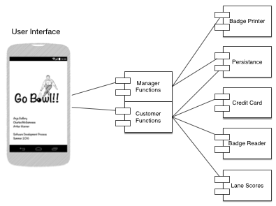

The components of the application are:

* The user interface
* The manager functions
* The customer functions
* An interface to the badge printer
* An interface to a persistant store
* An interface to the credit card scanner and processor
* An interface to the camera that reads badges
* An interface to the scoring system in the lanes

### 2.2 Deployment Diagram

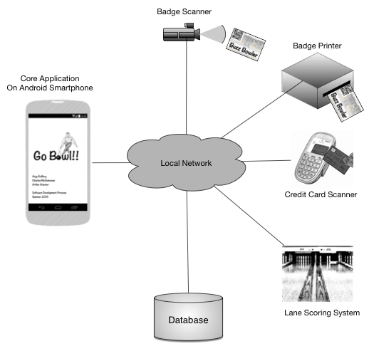

Because the application is being designed to run on smartphones, there is no practical method for implementing a direct connection between the components of the system.  Thus, we are assuming that all the devices are connected via a local network.  The components are deployed as follows:

* The smartphone which runs the application.
* The badge (ID card) scanner.  It may be tied to the camera in the phone, or it may be standalone; this is TBD.
* The printer which emits new ID cards
* The credit card scanner.  It may also serve as the gateway to the merchant services, or we may need a separate interface to merchant services.
* The Lane scoring system to retrieve the scores of the players
* A database to store persistent data.  This database may be implemented on the Smartphone for the initial proof of concent.

## 3 Low-Level Design

The design of the application mirrors the layout of the componnts of the application, generally speaking.

### 3.1 Class Diagram

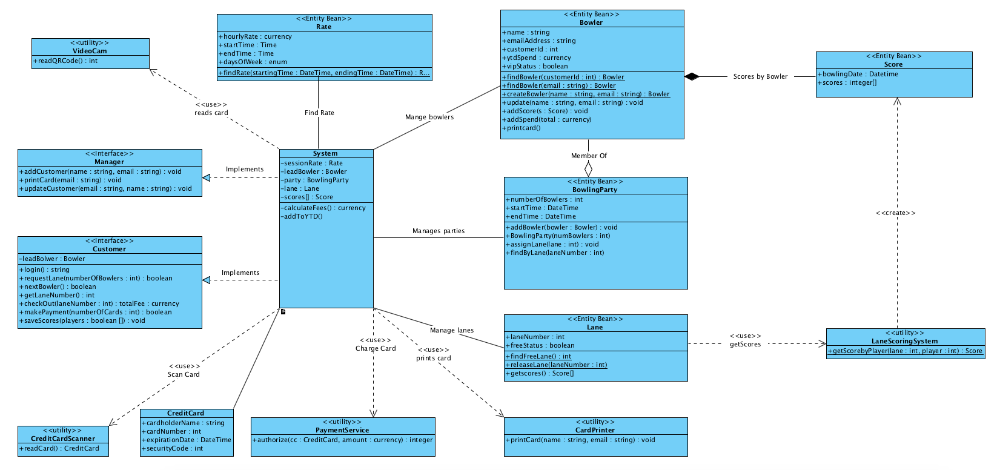

When mapping the components of the application to the underlying classes, the items of note are:

* The manager and customer components are expressed as interfaces, both of which are implemented by a common System class.
* Data which is moved between components (especially for persistence) are implemented as entity classes.

### 3.2 Other Diagrams

*TBD*

## 4 User Interface Design

### Program Startup (Splash and Manager/Customer Selection):
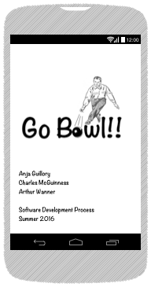
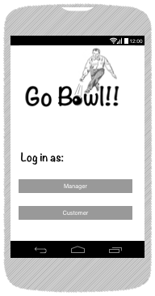

### Manager UI:
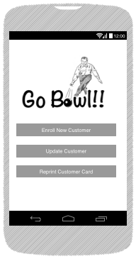
  
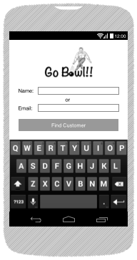
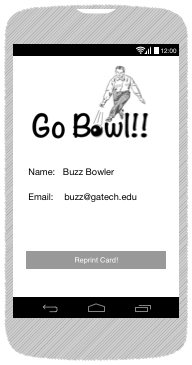
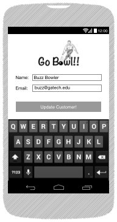

### Customer UI:
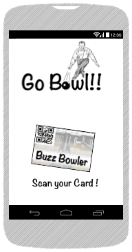
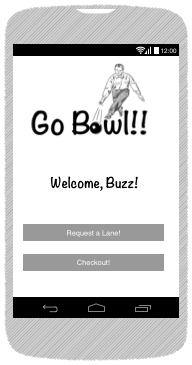

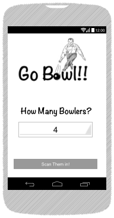
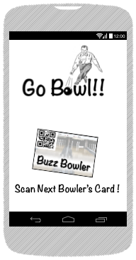
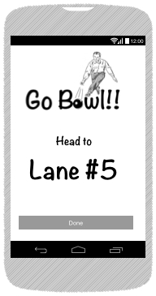

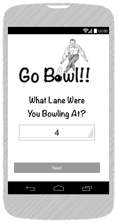
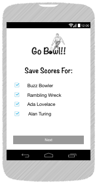
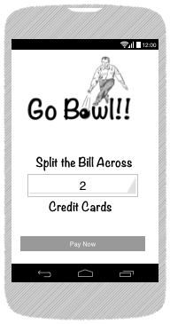
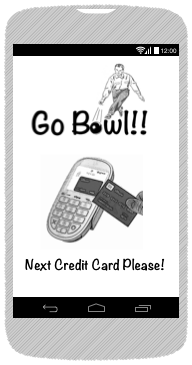

--

### Image Source Credits:

Credit Card Machine: Wikimedia user 	[SteveMccabe45](https://commons.wikimedia.org/wiki/File:Tappr_Card_Reader_NFC.jpg)  
Bowler: [PublicDomainPictures.net](http://www.publicdomainpictures.net/view-image.php?image=130468&picture=ten-pin-bowling)  
Bowling Alley: Wikimedia user [Rene Schwietzke](https://commons.wikimedia.org/wiki/File:Candlepin-bowling-usa-lanes-rs.jpg)  
Android Wireframes: [Leandro Cassa](https://www.graffletopia.com/stencils/1197)  
Other images part of OmniGraffle drawing application

