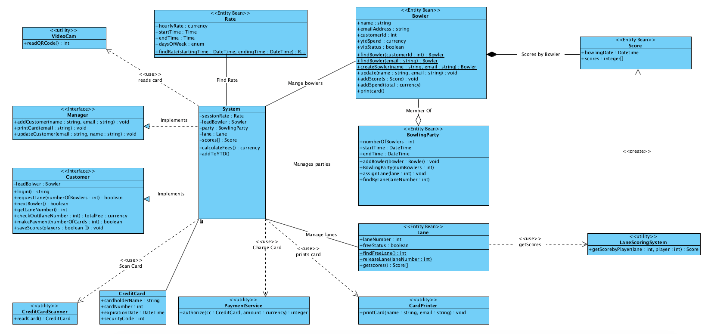

# Group Project 2
OMSCS CS6300, Summer 2016  
Anja Guillory - anjag@gatech.edu  
Charles McGuinness - charlesjmcguinness@gmail.com  
Arthur Wanner - arthurjwannerjr@gmail.com

## Design 1: Anja Guillory

### Quick Design Philosophy

Lorem ipsum dolor sit amet, consectetur adipiscing elit, sed do eiusmod tempor incididunt ut labore et dolore magna aliqua.

### Pros of this design:

* Lorem
* ipsum
* dolor
* sit
* amet

### Cons of this design:

* consectetur
* adipiscing
* elit

## Design 2: Charles McGuinness

### Quick Design Philosophy

The design was made with the intention of being able to trace actions taken at the user interface level
(which is not specified as part of this model) all the way through to the persistent entities and
hardware utility classes.  The interface classes manage the interactions with the UI, and the entity classes
hold the persistent data in the system. A few other classes exist to orchestrate business functions
around a particular use case.

### Pros of this design:

* Relatively small number of objects for a simpler, more understandable design
* Able to explain how each of the requirements is met

### Cons of this design:

* Business logic partially embedded in the "interface" classes rather than being put into free-standing classes.  Other parts of business logic distributed into entity classes where it probably doesn't belong.
* Some handwaving around utility classes (e.g., assumes there's a utility class that can read a QR code from a badge and generate the user id number).
* Unclear of all the relationships are modelled correctly.
* Was confused about use of terminology "interface" in assignment, probably should have built real java interfaces (although it seems odd when only one class implements an interface -- overkill?)

## Team Design

In our discussions about the design, we arrived at a team design that blends the two individual designs, trying to draw on the strengths of each.

From Design 1, we adopted the logic of having a centralized object for performing the business logic.  The assumption is that the amount of business logic is small enough that it makes sense to centralize it. You can see the creation of a "System" class that does the bulk of the work of the application.  It implements the interfaces for both Manager and Customer.  In some respects, this behaves like the "Controller" of an MVC model application.

From Design 2, we took the notion of having persistent entities to represent the core data the application has to track.  This fits into the notion of a "Model" in an MVC architecture.

Missing, of course, is the "View", which is out of scope for this assignment.  However, we have extended the interfaces of `Customer` and `Manager` to contain all of the interactions that the UI will need to meet the use-cases given in the design spec.

We assume that some sort of user interface exists that will interact with the user and collect the data needed by the application.  The methods in the interfaces are called from the UI, and they trigger actions in the `System` class appropriately (note the UML tool used does not replicate the list of methods into the box for `System` even if it fully implements them).

Many user interactions are "one and done".  For example, when a manager wishes to create a new customer, the UI collects the name and email address; this is sufficient for all processing required (create a new Bowler entity, print the card, and persist the bowler to the backing store).

For these kinds of interactionss, we assume that the UI will make a single call to the appropriate method in  `System` with all pertinent information, and that the return value will indicate status that is displayed to the user(s).

Other user interactions require multiple discrete steps.  For example, when the bowling party wishes to check out and pay their bill, `System` first scans retrieves the list of bowlers for the lane, computes the total bill, and waits for the bowlers to indicate how many ways to split the bill.  It then waits for each credit card to be swiped and then charges it, until the full amount of the bill has been covered.

For these kinds of interactions, we assume that the user interface instantiates a `System` class instance, and then a series of method invocations and returns process the transaction up until the next user interaction is required.  Following is a quick example of the interaction from the user interface and the `System` instance when 2 people wish to bowl:

When the first bowler indicates they wish to log in, `System` scans their card and remembers their customer id.  Then, through the UI, the bowler indicates that 2 of them wish to bowl; the system realizes that it needs to scan another card, and so returns a flag indicating so.  When the next bowler is ready to hold their card in front of the camera, the UI calls "nextBowler" to tell the system to scan their card.  When that is done, the system indicates that all bowler's cards have been scanned.  The bowlers then indicate that they are ready to bowl, and the UI asks for the lane number to send them to; `System` returns that, and that completes the interaction.  

Naturally, there is a lot of work that happens behind the scenes.  `System` creates and manages `Bowler` records for long term tracking of players.  `System` also creates the `BowlingParty` instances to track who is currently bowling.  And other entities are managed -- `Lane` and `Score` to track other items of persistent interest.

## Summary

The process of putting together the group deliverable was challenging in light of the short time frames between completion of Assignment 5 and the deliverable for this project.  This put a strain on the normally asynchronous approach to the classes each of us takes, as discussion requires multiple round trips to resolve issues.

The discussion itself often ranged around just communicating the different viewpoints of what was required to be delivered and less on the minutia of the design; had the specification been more precise in its definition, the work would have been more straightforward.  The discussion also covered many of the assumptions we made to fill the gaps in the requirements; these assumptions had a significant impact on the design.

